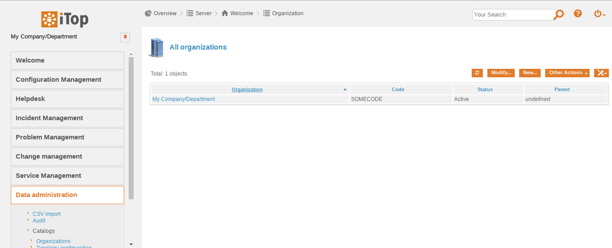
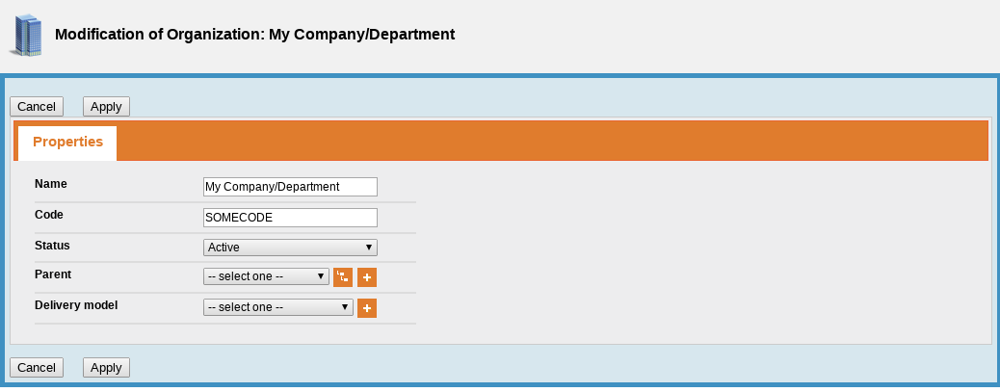
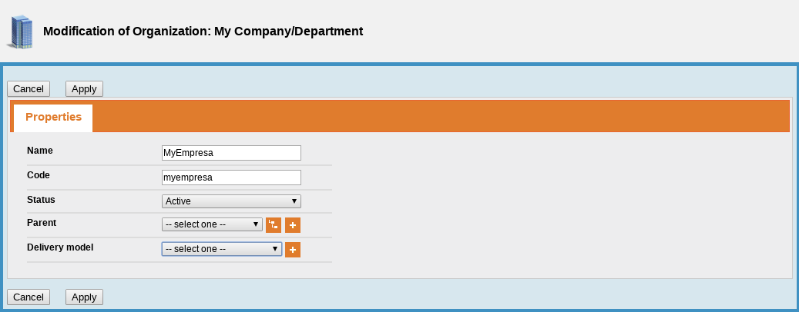
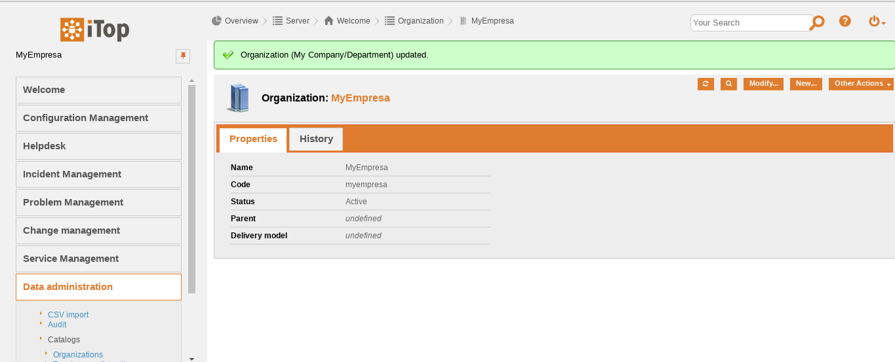

Modificando la organización
===========================

Las organizaciones se utilizan para definir los límites que son la base de las políticas de restricción de acceso. La mayoría de los objetos gestionados en iTop tienen un campo "Organización". Este campo generalmente representa a la organización que "posee" el objeto (por ejemplo, para elementos de configuración como servidores, PC, bastidores ...). Las organizaciones también se utilizan en la gestión de servicios, en este caso el "propietario" de un servicio es el "proveedor" de este servicio, mientras que el "propietario" de un contrato es generalmente el cliente que "compra" los servicios a través de este contrato.

Las organizaciones pueden organizarse en una jerarquía principal / secundaria, en cuyo caso, iTop se comporta como si la organización principal también fuera "propietaria" de los objetos de propiedad de todas sus organizaciones secundarias.

Solo los administradores y los administradores de configuración pueden agregar, modificar o eliminar organizaciones.

Para agregar/Modificar una organización, haga clic en "Organizations" en el módulo "Data Administration" y luego haga clic en el botón "Nuevo/Modify ...".

En este caso Modificaremos vemos como estaba

Realizamos los cambios que necesitemos y pulsamos Apply.

Vemos como se hacen los cambios efectivos.

