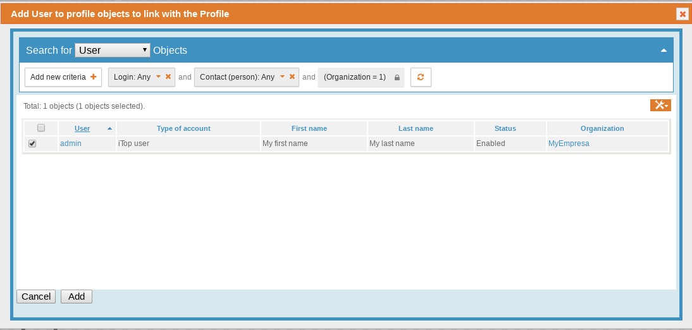

Integrando OCS en iTop
======================

**Data collector for OCS Inventory**

* name: Data collector for OCS Inventory
* description: Data Collector for OCS Inventory NG
* version: 1.0.4
* release: 2019-09-04
* code: ocsng-data-collectordif
* fusion: iTop Hub, Combodo site
* status: stable
* product: not-included
* standalone: yes

Esta aplicación independiente recopila información de un solo servidor OCS Inventory NG para llenar el iTop CMDB con los Servidores, PC y Máquinas Virtuales recopilados. El recopilador utiliza el motor de sincronización de datos de iTop para sincronizar la información entre OCS Inventory y iTop.

Hay disponible una extensión adicional (y opcional) para mostrar el contenido de las páginas de inventario de OCS directamente dentro de iTop, para cada objeto sincronizado (servidor, PC o máquina virtual), Pero con esta versión de iTop 2.5 no funciona bien aun.

Características
+++++++++++++++++

* Inventario automatizado de marca, modelo, familia de SO, versión de SO, servidor físico, PC y máquina virtual desde el servidor de inventario OCS
* Inventario automatizado de interfaces de red
* El recopilador puede residir en cualquier sistema con acceso web a iTop y mysql al servidor de inventario OCS
* Creación y actualización automática de las fuentes de datos de sincronización en iTop.
* Una pequeña extensión opcional está disponible para mostrar una pestaña adicional "Inventario OCS" en PC, Servidores y VirtualMachines sincronizados. Esta pestaña muestra la página de OCS para el dispositivo (usando un IFRAME).

Limitaciones
++++++++++++++++

* El recopilador no recupera la información del software instalado
* El recopilador no está normalizando el modelo, la familia del sistema operativo y la versión del sistema operativo.
* El recopilador sincroniza solo las PC y los servidores que tienen un número de serie válido en OCS
* La versión actual no es compatible con TeemIP.
* Si se accede a su iTop utilizando HTTPS, entonces lo mismo debe ser cierto para el Inventario OCS, de lo contrario, el marco en línea del Inventario OCS dentro de iTop no se mostrará debido a las restricciones de seguridad de los navegadores.
* No hay un inicio de sesión único entre iTop y OCS, por lo que tendrá que iniciar sesión en OCS cuando se muestre la pestaña OCS.

Requerimientos
+++++++++++++++

* PHP versión 5.3.0
* Un acceso a la base de datos mysql de OCS Inventory NG
* Un acceso a los servicios web de iTop (REST + synchro_import.php y synchro_exec.php). Nota: a partir de iTop 2.5.0, el usuario debe tener el perfil Usuario de Servicios REST en iTop.

Instalación
++++++++++++++++

**Instalación de la extensión de integración de inventario OCS:**

**Instalación automatizada vía iTop Hub**

Ir a la tienda de extensiones en iTop Hub. Haga clic en el ícono del carrito para realizar la adquisición de la extensión y siga las instrucciones en pantalla para implementarla en su instancia de iTop

**Instalación manual**

* descomprima el archivo "Data Collector for OCS Inventory NG 1.0.4.zip" en la carpeta de extensions de iTop 
* Asegúrese de que el proceso del servidor web tenga suficientes derechos para leer los archivos copiados. 
* Iniciar la configuración de iTop Seleccione la extensión de integración de inventario OCS, cuando se le solicite
* Este proceso lo hicimos en la instalación inicial.

.. figure:: ../images/install/16.png

Para verificar, nos vamos a "iTop Hub" y seleccionamos "Deployed extensions"

Edite el archivo de configuración de iTop para especificar la URL para acceder al servidor web de OCS, pero antes le damos el permiso de escritura::

	ls -l /var/www/html/itop/conf/production/config-itop.php
	chmod 644 /var/www/html/itop/conf/production/config-itop.php

Vamos agregar esto, la dirección IP es del servidor de OCS que tenga el Manager Console::

	'itop-ocsng' => array (
		'ocsng_url' => 'http://192.168.1.220/ocsreports/',
	),

Editamos ::

	vi /var/www/html/itop/conf/production/config-itop.php

Quedaría asi::

	<?php

	/**
	 *
	 * Configuration file, generated by the iTop configuration wizard
	 *
	 * The file is used in MetaModel::LoadConfig() which does all the necessary initialization job
	 *
	 */
	$MySettings = array(

		'itop-ocsng' => array (
		        ocsng_url' => 'http://192.168.1.220/ocsreports/',
		),
		// access_message: Message displayed to the users when there is any access restriction
		//      default: 'iTop is temporarily frozen, please wait... (the admin team)'
		'access_message' => 'iTop is temporarily frozen, please wait... (the admin team)',
		[...]

Volvemos a colocar los permisos como estaban::

	chmod 444 /var/www/html/itop/conf/production/config-itop.php

Instalar el colector de datos para el inventario de OCS
++++++++++++++++++++++++++++++++++++++++++++++++++++++++

El contenido del "Data Collector for OCS Inventory NG 1.0.4.zip" ya lo tenemos en la carpeta "/var/www/html/itop/extensions/ocsng-data-collector/". Esto puede estar en otra máquina pero debe tener un acceso SQL a la base de datos OCS NG y un acceso web al servidor iTop.
cree el archivo conf / params.local.xml para adaptarlo a su instalación, suministrando las credenciales apropiadas para conectarse a OCS NG e iTop.
De forma predeterminada, este archivo debe contener los valores utilizados para conectarse al servidor iTop y al servidor OCS NG:

Creamos un archivo "params.local.xml" utilizando como principio el archivo "params.distrib.xml"::

	cd  /var/www/html/itop/extensions/ocsng-data-collector/
	cp -p conf/params.distrib.xml conf/params.local.xml

Debemos agregar estas lineas en el archivo "params.local.xml" dentro de <parameters> </parameters>::

	<itop_url>http://192.168.1.230/itop</itop_url>
	<itop_login>admin</itop_login>
	<itop_password>admin</itop_password>
	<contact_to_notify>carlos.gomez@demo.com</contact_to_notify>
	<synchro_user>admin</synchro_user>
	<sql_host>192.168.1.210</sql_host>
	<sql_database>ocsweb;charset=UTF8</sql_database>
	<sql_login>ocs</sql_login>
	<sql_password>passworhere</sql_password>

Editamos el archivo "params.local.xml" para configurar los datos necesarios, quedando así::

	vi conf/params.local.xml

	<?xml version="1.0" encoding="UTF-8"?>
	<!-- Default values for parameters. Do NOT alter this file, use params.local.xml instead -->
	<parameters>

	<itop_url>http://192.168.1.230/itop/</itop_url>
	<itop_login>admin</itop_login>
	<itop_password>admin</itop_password>
	<contact_to_notify>carlos.gomez@demo.com</contact_to_notify>
	<synchro_user>admin</synchro_user>
	<sql_host>192.168.1.210</sql_host>
	<sql_database>ocsweb;charset=UTF8</sql_database>
	<sql_login>ocs</sql_login>
	<sql_password>passworhere</sql_password>

Configuración
++++++++++++++

De forma predeterminada, la configuración de la recopilación de datos se define en los recopiladores de archivos "params.distrib.xml". ¡No modifique este archivo! Si necesita adaptar la configuración, hágalo en "params.local.xml" y copie/pegue las definiciones necesarias en él (la estructura de ambos archivos XMl es la misma). Esta configuración define qué consultas SQL deben ejecutarse en el servidor OCS NG para recuperar los datos y sincronizarlos con iTop.

Agregue estas lineas en el archivo "params.local.xml" al final pero dentro de <parameters> </parameters>, en <default_org_id> debe ir el nombre de su Organización activa a la cual usted quiere que se le cargue la información del OCS::

	  [...]
	  <default_org_id>MyEmpresa</default_org_id>
	  <default_status>production</default_status>
	  <PCCollection>yes</PCCollection>
	  <ServerCollection>yes</ServerCollection>
	  <VMCollection>yes</VMCollection>
	  <OCSBrandCollector_query>SELECT DISTINCT SMANUFACTURER as primary_key, SMANUFACTURER as name FROM bios</OCSBrandCollector_query>
	  <OCSOSFamilyCollector_query>SELECT DISTINCT OSNAME as primary_key,OSNAME as name FROM hardware</OCSOSFamilyCollector_query>
	  <OCSOSVersionCollector_query>SELECT DISTINCT CONCAT(OSNAME,OSVERSION) as primary_key,OSNAME as osfamily_id,OSVERSION as name FROM hardware</OCSOSVersionCollector_query>
	  <OCSServerModelCollector_query>SELECT DISTINCT CONCAT(SMANUFACTURER,SMODEL) AS primary_key,SMANUFACTURER as brand_id,SMODEL as name, 'Server' As type FROM bios WHERE TYPE COLLATE utf8_general_ci NOT IN ('Notebook','Laptop') AND SMANUFACTURER COLLATE utf8_general_ci NOT LIKE 'VMware%'</OCSServerModelCollector_query>
	  <OCSServerCollector_query>SELECT b.SSN as primary_key,h.ID as ocsid, h.NAME as name, h.OSNAME as osfamily_id,h.OSVERSION as osversion_id, h.PROCESSORT as cpu, h.MEMORY as ram, h.IPADDR as managementip, b.SMANUFACTURER as brand_id,b.SMODEL as model_id,b.SSN as serialnumber, '$default_status$' as status, '$default_org_id$' as org_id FROM hardware AS h JOIN bios AS b ON h.id=b.hardware_id WHERE b.TYPE COLLATE utf8_general_ci NOT IN ('Notebook','Laptop') AND SMANUFACTURER COLLATE utf8_general_ci NOT LIKE 'VMware%'</OCSServerCollector_query>
	  <OCSServerPhysicalInterfaceCollector_query>SELECT  n.ID as primary_key,n.DESCRIPTION as name, IF(SPEED REGEXP '^[0-9]+ ', LEFT(SPEED, LOCATE(' ', SPEED)), SPEED) as speed, MACADDR as macaddress, IPADDRESS as ipaddress, IPMASK as ipmask,IPGATEWAY as ipgateway,h.NAME as connectableci_id FROM networks AS n JOIN hardware AS h ON n.hardware_id=h.id JOIN bios AS b ON h.id=b.hardware_id WHERE SMANUFACTURER COLLATE utf8_general_ci NOT LIKE 'VMware%' AND b.TYPE COLLATE utf8_general_ci NOT IN ('Notebook','Laptop')</OCSServerPhysicalInterfaceCollector_query>
	  <OCSPCModelCollector_query>SELECT DISTINCT CONCAT(SMANUFACTURER,SMODEL) AS primary_key,SMANUFACTURER as brand_id,SMODEL as name, 'PC' As type FROM bios WHERE TYPE COLLATE utf8_general_ci IN ('Notebook','Laptop') AND SMANUFACTURER NOT LIKE 'VMware%'</OCSPCModelCollector_query>
	  <OCSPCCollector_query>SELECT b.SSN as primary_key,h.ID as ocsid, h.NAME as name, h.OSNAME as osfamily_id,h.OSVERSION as osversion_id, h.PROCESSORT as cpu, h.MEMORY as ram, b.SMANUFACTURER as brand_id,b.SMODEL as model_id,b.SSN as serialnumber, '$default_status$' as status, '$default_org_id$' as org_id FROM hardware AS h JOIN bios AS b ON h.id=b.hardware_id WHERE b.TYPE COLLATE utf8_general_ci IN ('Notebook','Laptop') AND SMANUFACTURER COLLATE utf8_general_ci NOT LIKE 'VMware%'</OCSPCCollector_query> 
	  <OCSPCPhysicalInterfaceCollector_query>SELECT  n.ID as primary_key,n.DESCRIPTION as name, IF(SPEED REGEXP '^[0-9]+ ', LEFT(SPEED, LOCATE(' ', SPEED)), SPEED) as speed, MACADDR as macaddress, IPADDRESS as ipaddress, IPMASK as ipmask,IPGATEWAY as ipgateway,h.NAME as connectableci_id FROM networks AS n JOIN hardware AS h ON n.hardware_id=h.id JOIN bios AS b ON h.id=b.hardware_id WHERE SMANUFACTURER COLLATE utf8_general_ci NOT LIKE 'VMware%' AND b.TYPE COLLATE utf8_general_ci IN ('Notebook','Laptop')</OCSPCPhysicalInterfaceCollector_query>
	  <OCSVirtualMachineCollector_query>SELECT h.ID as primary_key,h.ID as ocsid, h.NAME as name, h.OSNAME as osfamily_id,h.OSVERSION as osversion_id, h.PROCESSORT as cpu, h.MEMORY as ram,h.IPADDR as managementip, '$default_status$' as status, '$default_org_id$' as org_id FROM hardware AS h JOIN bios AS b ON h.id=b.hardware_id WHERE SMANUFACTURER COLLATE utf8_general_ci LIKE 'VMware%'</OCSVirtualMachineCollector_query>
	  <OCSLogicalInterfaceCollector_query>SELECT  n.ID as primary_key,n.DESCRIPTION as name, IF(SPEED REGEXP '^[0-9]+ ', LEFT(SPEED, LOCATE(' ', SPEED)), SPEED) as speed, MACADDR as macaddress, IPADDRESS as ipaddress, IPMASK as ipmask,IPGATEWAY as ipgateway,h.NAME as virtualmachine_id FROM networks AS n JOIN hardware AS h ON n.hardware_id=h.id JOIN bios AS b ON h.id=b.hardware_id WHERE SMANUFACTURER COLLATE utf8_general_ci LIKE 'VMware%'</OCSLogicalInterfaceCollector_query>

	</parameters>

Principios
++++++++++++++ 

* Para cada clase de objeto para importar a iTop (PC, Servidor, VM, Marca, Modelo, OSVersion OSFamily), la aplicación de recopilador crea una Fuente de datos sincronizada.
* Cada recopilador está asociado con una consulta SQL (a través del parámetro <nombre_del_collector> _cuerpo).
* Esta consulta debe devolver la columna donde los alias (es decir, el "nombre" de las columnas) corresponden a los campos esperados para la Fuente de Datos Sincrónica correspondiente.
* Estas consultas se pueden adaptar a sus necesidades (por ejemplo, para diferenciar mejor las PC y los servidores o para cambiar / configurar algunos valores predeterminados para algunas columnas)
* Debido a que la sincronización de las PC, los servidores y las máquinas virtuales dependen de su propia consulta SQL, es importante asegurarse de que los resultados de estas 3 consultas no se superpongan. De lo contrario, el mismo "sistema" se importará varias veces en itop (por ejemplo, como una PC y un Servidor).

Estas consultas se pueden redefinir en el archivo "params.local.xml" para tener en cuenta sus necesidades específicas (por ejemplo, el cambio de estado del servidor creado, la PC, la máquina virtual, así como la organización predeterminada). Por defecto, solo se crean máquinas virtuales VMWare. La consulta de Virtualmachine se debe adaptar si desea manejar otro tipo de máquinas virtuales

Nota:

	El archivo params.distrib.xml contiene los valores predeterminados para los parámetros. Ambos archivos (params.distrib.xml y params.local.xml) usan exactamente el mismo formato. Pero params.distrib.xml se considera como la referencia y debe permanecer sin modificaciones. Si necesita cambiar el valor de un parámetro, copie y modifique su definición en params.local.xml. Los valores en params.local.xml tienen prioridad sobre los de params.distrib.xml

Uso
+++++++++
Recuerde otorgar al usuario los permisos de "REST Services User" en "Profiles"

Seleccione en "Users" y luego en "Modify"

Seleccione "Add user"

Escoja el usuario admin, para este ejemplo y pulse el boton "add"

Listo ya el usuario admin esta en este profile que es importante para la ejecución de la integración, recuerde dar sobre "Apply"

Para iniciar la recopilación de datos y la sincronización con iTop, ejecute el siguiente comando (desde el directorio raíz donde está instalada la aplicación del recopilador de datos)en este caso en "var/www/html/itop/extensions/ocsng-data-collector/"::

	chmod 444 /var/www/html/itop/conf/production/config-itop.php
	chown -R apache.apache /var/www/html/itop
	cd var/www/html/itop/extensions/ocsng-data-collector/
	php exec.php

Debe tener un resultado como este::

	Warning - Contact to notify (carlos.gomez@demo.com) not found in iTop. Nobody will be notified of the results of the synchronization.
	Info - Synchro User: 'admin' <my.email@foo.org> (1).
	Info - There is no Synchro Data Source named 'Synchro Brand OCSng' in iTop. Let's create it.
	Info - There is no Synchro Data Source named 'Synchro OSFamily OCSng' in iTop. Let's create it.
	Info - There is no Synchro Data Source named 'Synchro OSVersion OCSng' in iTop. Let's create it.
	Info - There is no Synchro Data Source named 'Synchro Server Model OCSng' in iTop. Let's create it.
	Info - There is no Synchro Data Source named 'Synchro Server OCSng' in iTop. Let's create it.
	Info - Skipping optional attribute enclosure_id.
	Info - Skipping optional attribute powerA_id.
	Info - Skipping optional attribute powerB_id.
	Info - Skipping optional attribute rack_id.
	Info - [OCSServerCollector] The column tickets_list is used for storing the OCS ID in order to display the OCS tab on Servers. You can safely ignore the warning about it.
	Info - There is no Synchro Data Source named 'Synchro Server PhysicalInterface OCSng' in iTop. Let's create it.
	Info - There is no Synchro Data Source named 'Synchro PC Model OCSng' in iTop. Let's create it.
	Info - There is no Synchro Data Source named 'Synchro PC OCSng' in iTop. Let's create it.
	Info - [OCSPCCollector] The column tickets_list is used for storing the OCS ID in order to display the OCS tab on PCs. You can safely ignore the warning about it.
	Info - There is no Synchro Data Source named 'Synchro PC PhysicalInterface OCSng' in iTop. Let's create it.
	Info - There is no Synchro Data Source named 'Synchro VirtualMachine OCSng' in iTop. Let's create it.
	Info - [OCSVirtualMachineCollector] The column tickets_list is used for storing the OCS ID in order to display the OCS tab on Virtual Machines. You can safely ignore the warning about it.
	Info - There is no Synchro Data Source named 'Synchro LogicalInterface OCSng' in iTop. Let's create it.
	Info - OCSBrandCollector beginning of data collection...
	Info - Writing to file '/var/www/html/itop/extensions/ocsng-data-collector/data/OCSBrandCollector-1.csv'.
	Info - OCSBrandCollector end of data collection.
	Info - OCSOSFamilyCollector beginning of data collection...
	Info - Writing to file '/var/www/html/itop/extensions/ocsng-data-collector/data/OCSOSFamilyCollector-1.csv'.
	Info - OCSOSFamilyCollector end of data collection.
	Info - OCSOSVersionCollector beginning of data collection...
	Info - Writing to file '/var/www/html/itop/extensions/ocsng-data-collector/data/OCSOSVersionCollector-1.csv'.
	Info - OCSOSVersionCollector end of data collection.
	Info - OCSServerModelCollector beginning of data collection...
	Info - Writing to file '/var/www/html/itop/extensions/ocsng-data-collector/data/OCSServerModelCollector-1.csv'.
	Info - OCSServerModelCollector end of data collection.
	Info - OCSServerCollector beginning of data collection...
	Info - Writing to file '/var/www/html/itop/extensions/ocsng-data-collector/data/OCSServerCollector.raw-1.csv'.
	Warning - Invalid column 'ocsid', will be ignored.
	Info - OCSServerCollector end of data collection.
	Info - OCSServerPhysicalInterfaceCollector beginning of data collection...
	Info - Writing to file '/var/www/html/itop/extensions/ocsng-data-collector/data/OCSServerPhysicalInterfaceCollector-1.csv'.
	Info - OCSServerPhysicalInterfaceCollector end of data collection.
	Info - OCSPCModelCollector beginning of data collection...
	Info - OCSPCModelCollector end of data collection.
	Info - OCSPCCollector beginning of data collection...
	Info - OCSPCCollector end of data collection.
	Info - OCSPCPhysicalInterfaceCollector beginning of data collection...
	Info - OCSPCPhysicalInterfaceCollector end of data collection.
	Info - OCSVirtualMachineCollector beginning of data collection...
	Info - OCSVirtualMachineCollector end of data collection.
	Info - OCSLogicalInterfaceCollector beginning of data collection...
	Info - OCSLogicalInterfaceCollector end of data collection.
	Info - Uploading data file '/var/www/html/itop/extensions/ocsng-data-collector/data/OCSBrandCollector-1.csv'
	Info - Starting synchronization of the data source 'Synchro Brand OCSng'...
	Error - Synchronization of data source 'Synchro Brand OCSng' answered: Objects creation errors: 1
	Info - Uploading data file '/var/www/html/itop/extensions/ocsng-data-collector/data/OCSOSFamilyCollector-1.csv'
	Info - Starting synchronization of the data source 'Synchro OSFamily OCSng'...
	Info - Synchronization of data source 'Synchro OSFamily OCSng' succeeded.
	Info - Uploading data file '/var/www/html/itop/extensions/ocsng-data-collector/data/OCSOSVersionCollector-1.csv'
	Info - Starting synchronization of the data source 'Synchro OSVersion OCSng'...
	Info - Synchronization of data source 'Synchro OSVersion OCSng' succeeded.
	Info - Uploading data file '/var/www/html/itop/extensions/ocsng-data-collector/data/OCSServerModelCollector-1.csv'
	Info - Starting synchronization of the data source 'Synchro Server Model OCSng'...
	Error - Synchronization of data source 'Synchro Server Model OCSng' answered: Objects creation errors: 1
	Info - Processing '/var/www/html/itop/extensions/ocsng-data-collector/data/OCSServerCollector.raw-1.csv'...
	Warning - No mapping found with key: '_', 'model_id' will be set to zero.
	Info - End of processing of '/var/www/html/itop/extensions/ocsng-data-collector/data/OCSServerCollector.raw-1.csv'...
	Info - Uploading data file '/var/www/html/itop/extensions/ocsng-data-collector/data/OCSServerCollector-1.csv'
	Info - Starting synchronization of the data source 'Synchro Server OCSng'...
	Info - Synchronization of data source 'Synchro Server OCSng' succeeded.
	Info - Uploading data file '/var/www/html/itop/extensions/ocsng-data-collector/data/OCSServerPhysicalInterfaceCollector-1.csv'
	Info - Starting synchronization of the data source 'Synchro Server PhysicalInterface OCSng'...
	Error - Synchronization of data source 'Synchro Server PhysicalInterface OCSng' answered: Objects creation errors: 2
	Info - Starting synchronization of the data source 'Synchro PC Model OCSng'...
	Info - Synchronization of data source 'Synchro PC Model OCSng' succeeded.
	Info - Starting synchronization of the data source 'Synchro PC OCSng'...
	Info - Synchronization of data source 'Synchro PC OCSng' succeeded.
	Info - Starting synchronization of the data source 'Synchro PC PhysicalInterface OCSng'...
	Info - Synchronization of data source 'Synchro PC PhysicalInterface OCSng' succeeded.
	Info - Starting synchronization of the data source 'Synchro VirtualMachine OCSng'...
	Info - Synchronization of data source 'Synchro VirtualMachine OCSng' succeeded.
	Info - Starting synchronization of the data source 'Synchro LogicalInterface OCSng'...
	Info - Synchronization of data source 'Synchro LogicalInterface OCSng' succeeded.

Las siguientes opciones de línea de comando (opcionales) están disponibles:

En "Admin Tool" en "Synchronization Data Sources" debemos ver que se crearon los conectores

.. figure:: ../images/integrations/08.png

Y si seleccionamos alguna, en este caso escogimos "Synchro Server OCSng" y vamos al tab "Status"

Podemos tener una idea de que se ha creado o actualizado.

Al irnos ahora a "Configuration Management" y en "Overview" veremos los servers cargados

.. figure:: ../images/integrations/11.png

