Integrando Zabbix en iTop
=============================

Todo esta en la documentación oficial https://www.itophub.io/wiki/page?id=2_3_0%3Aadvancedtopics%3Acreate_ticket

Scripts para crear un ticket desde la línea de comando
+++++++++++++++++++++++++++++++++++++++++++++++++++++++

En la página oficial contiene scripts de ejemplo, en varios idiomas, para crear un ticket en iTop desde la línea de comandos. Los scripts utilizan la API REST/JSON de iTop para crear un ticket en un servidor iTop remoto (el script debe tener acceso a iTop a través de http / https). Los scripts están diseñados para su uso con Nagios, ya que esperan 4 parámetros: host, service, service_status y service_state_type, pero el único parámetro significativo es el host y es bastante fácil ajustar los scripts a sus necesidades específicas.

En particular vamos utilizar bash script y adaptado para Zabbix, porque nos parece mas fácil y universal.

Vamos utilizar este::

	#!/bin/bash
	##################################################################################
	#                                                                                #
	# Example script for creating a UserRequest ticket via the REST/JSON webservices #
	#                                                                                #
	##################################################################################
	 
	# iTop location and credentials, change them to suit your iTop installation
	ITOP_URL="http://192.168.1.230/itop"
	ITOP_USER="admin"
	ITOP_PWD="admin"
	 
	 
	MESSAGE=$1

	HOST=$(echo -e "$MESSAGE" | grep Host | awk -F ":" '{print $2}'| tr -d " ")
	HOST=$(echo $HOST | tr -d '\r')
	SERVICE=$(echo -e "$MESSAGE" | grep Problem | awk -F ":" '{print $2}')
	SERVICE=$(echo $SERVICE | tr -d "\(\)\[\]\-\:\"")
	SERVICE_STATUS=$(echo -e "$MESSAGE" | grep Severity | awk -F ":" '{print $2}')
	SERVICE_STATUS_TYPE="HARD"

	echo -e "Inicia ticket" > /tmp/creaticket.log
	echo -e "El numero de arg es: $#" >> /tmp/creaticket.log
	echo -e "$MESSAGE" >> /tmp/creaticket.log
	echo -e "##################################" >> /tmp/creaticket.log

	echo -e "El host es:$HOST-este" >> /tmp/creaticket.log
	echo -e "El servicio es:$SERVICE" >> /tmp/creaticket.log
	echo -e "El severity es:$SERVICE_STATUS" >> /tmp/creaticket.log
	echo -e "El Type es:$SERVICE_STATUS_TYPE" >> /tmp/creaticket.log

	# Default values, adapt them to your configuration
	TICKET_CLASS="UserRequest"
	ORGANIZATION="SELECT Organization JOIN FunctionalCI AS CI ON CI.org_id=Organization.id WHERE CI.name='"${HOST}"'"
	TITLE="$HOST with SERVICE PROBLEM"
	DESCRIPTION="The service $SERVICE is in state $SERVICE_STATUS on $HOST"
	 
	# Let's create the ticket via the REST/JSON API
	# if [[ ( "$SERVICE_STATUS" != "OK" ) && ( "$SERVICE_STATUS" != "UP" ) && ( "$SERVICE_STATUS_TYPE" == "HARD" ) ]]; then
		CIS_LIST='[{"functionalci_id":"SELECT FunctionalCI WHERE  name=\"'"$HOST"'\"", "impact_code": "manual"}]'
		JSON_DATA='{"operation":"core/create", "class":"'"${TICKET_CLASS}"'", "fields": {"functionalcis_list":'"${CIS_LIST}"', "org_id":"'"${ORGANIZATION}"'", "title":"'"$TITLE"'", "description":"'"$DESCRIPTION"'"}, "comment": "Created by the Monitoring", "output_fields": "id"}'
	 
		RESULT=`wget -q --post-data='auth_user='"${ITOP_USER}"'&auth_pwd='"${ITOP_PWD}"'&json_data='"${JSON_DATA}" --no-check-certificate -O -  "${ITOP_URL}/webservices/rest.php?version=1.0"`
	 
	echo -e "###########################"

		PATTERN='"key":"([0-9])+"'
		if [[ $RESULT =~ $PATTERN ]]; then
		        echo "Ticket created successfully" >> /tmp/creaticket.log
		else
		        echo "ERROR: failed to create ticket" >> /tmp/creaticket.log
		        echo $RESULT >> /tmp/creaticket.log
		fi
	# else
	#         echo "Service State Type != HARD, doing nothing"
	# fi

Como usarlo
++++++++++++++++

Estos serian los argumentos que deben ser cuatro (4)::

	create-ticket.bash <host> <service> <service_status> <service_state_type>

Configuración
++++++++++++++

Cambie las 3 líneas en la parte superior de la secuencia de comandos para ajustarse a su entorno::

	ITOP_URL="http://192.168.1.230/itop"
	ITOP_USER="admin"
	ITOP_PWD="admin"

Luego cambia los valores por defecto a tu gusto::

	# Default values, adapt them to your configuration
	TICKET_CLASS="UserRequest"
	ORGANIZATION="SELECT Organization JOIN FunctionalCI AS CI ON CI.org_id=Organization.id WHERE CI.name='"${HOST}"'"
	TITLE="Service Down on $1"
	DESCRIPTION="The service $SERVICE is in state $SERVICE_STATUS on $HOST"

Troubleshooting
++++++++++++++++++++++++

Puede probar la creación del ticket ejecutando el script manualmente. Por ejemplo, si existe un servidor llamado Server1 en su iTop, puede ejecutar el siguiente comando para crear un ticket::

	create-ticket.bash "debian" "Manual Test" "DOWN" "HARD"
	Ticket created successfully

Este otro código lo utilizamos por si falla la creación del ticket igual forma envié la creación de un ticket para verificar este error::

	http://192.168.1.230/itop/webservices/rest.php?version=1.1&auth_user=admin&auth_pwd=admin&json_data={"operation":"core/create","class":"UserRequest","output_fields":"id","comment":"ErrtoZabbix","fields":{"org_id":"1","title":"Error create Ticket","description":"Error to create ticket from Zabbix, please contacte the TI Master"}}

Configurando Zabbix
+++++++++++++++++++++++++++++

Ya que tenemos creado el script vamos a copiarlo en el servidor de Zabbix en la siguiente ruta "/usr/lib/zabbix/alertscripts", recordemos que debe tener permisos de ejecución.

En Zabbix debemos crear el "Media Types", nos vamos a "Administration" y le damos "Create Media Type"

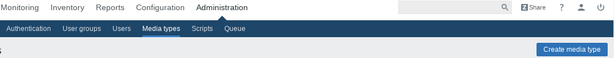

Llenamos los campos:
* Name
* Type  - debe ser script
* Script Name - Debe ser tal cual el nombre del script que copiamos en el paso anterior
* Script Parameters - {ALERT.MESSAGE}  - porque en el mensaje le vamos a pasar todos los datos

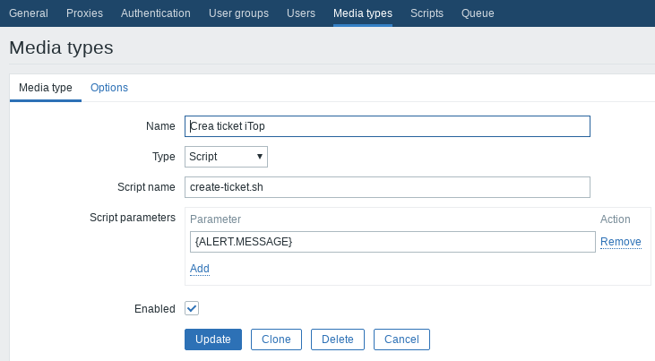

Ahora el "Media Type" se lo debemos asignar a un usuario en Zabbix con privilegios de Administrador. Nos vamos a "Administration" luego en "Users" y ahí buscamos el usuario indicado

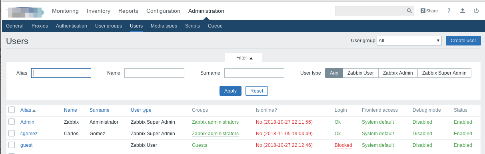

Ahí nos vamos al TAB de Media 

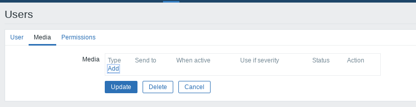

Le damos "add" y buscamos la "Media Type" que creamos agregamos un "Send to" aunque no se utilizara.

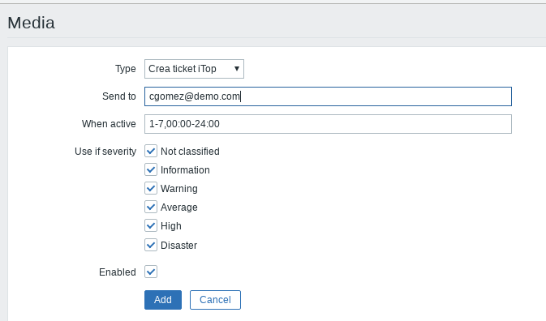

Ya lo tenemos asociado al usuario, le damos "Update"

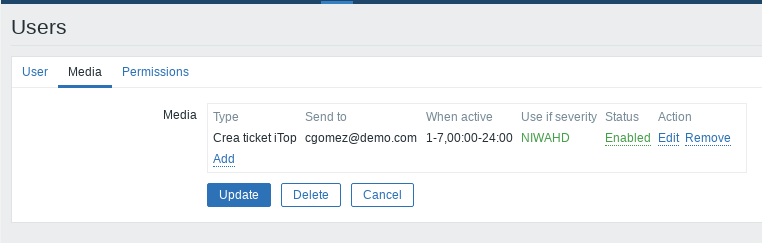

Ahora nos vamos a "Configuration" y en "Action" le damos "Create Action"

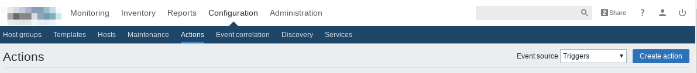

En el tab de Action colocamos el, "Name" Cualquiera de nuestro gusto y vamos agregando las condiciones

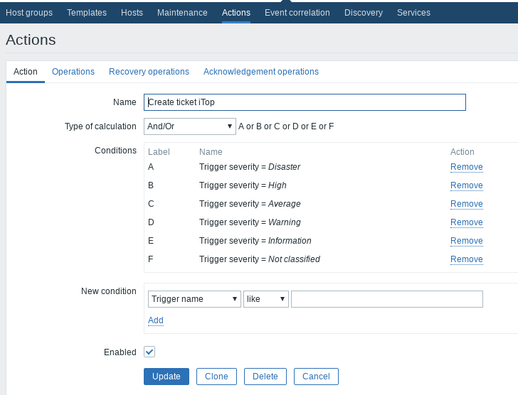

En "Operations" solo cargamos esto:

* Default subject:

	Default subject

* Default message:

	Host: {HOST.NAME}

	Problem name: {TRIGGER.NAME}

	Severity: {TRIGGER.SEVERITY}

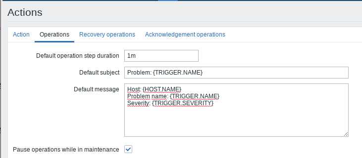

Y la Operacion que vamos agregar es

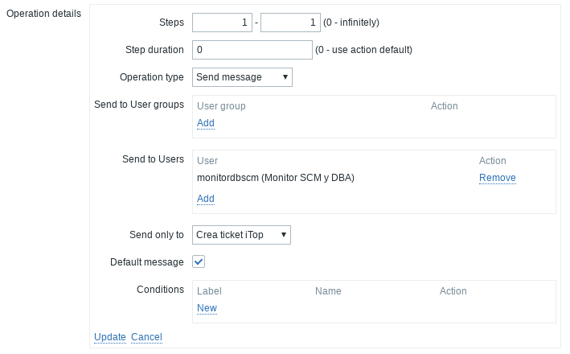

Lista la configuracón le damos guardar

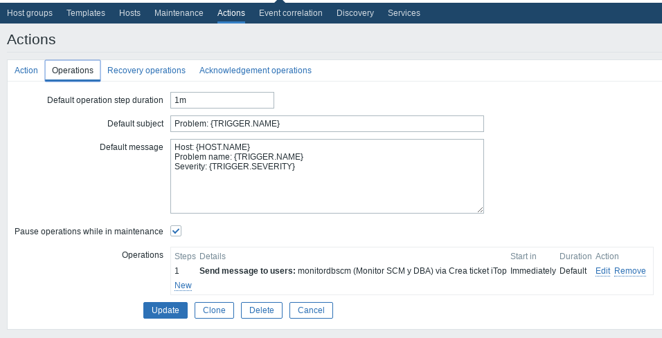

Nos aseguramos que este habilitado.

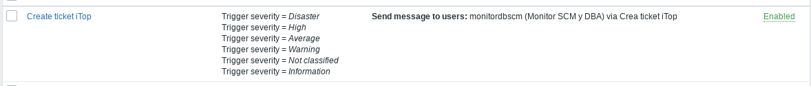

Listo, ya con esto cuando en Zabbix se dispare un Trigger esta acción se ejecutara llamando al script y pasándole los datos en el MESSAGE y si todo marcha bien se creara el ticket en iTop

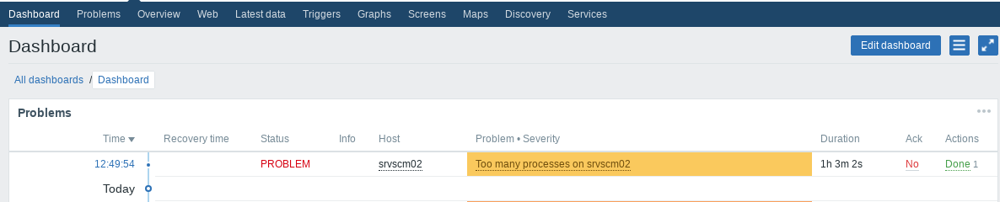

Ticket creado en iTop

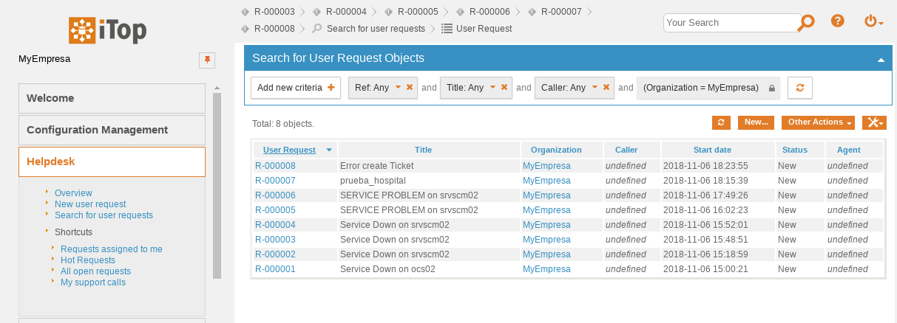

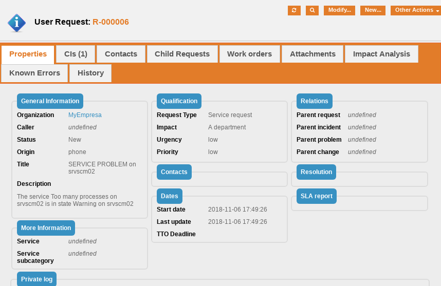

 

