Instalar y configurar iTop
============================

Instalando los prerequisitos
+++++++++++++++++++++++++++++

Los requisitos previos son:

* Minimo PHP 5.6, recomendado ​PHP 7.x (7.0, 7.1 or 7.2)
* Minimo MySQL 5.5.3 (o MariaDB 5.5), recomendado MySQL 5.7

**configuremos el EPEL su ultimo release**, En OracleLinux/Redhat/Centos 7 como Linux::

	yum install -y wget
	
	wget http://dl.fedoraproject.org/pub/epel/epel-release-latest-7.noarch.rpm
	rpm -ivh epel-release-latest-7.noarch.rpm
	yum update
	yum install -y unzip wget

**Instalar PHP 5.X**, Vamos a instalar PHP 5.X con la ayuda de los repos de remi.::

	yum install -y  http://rpms.remirepo.net/enterprise/remi-release-7.rpm

Instalamos yum-utils::

	yum install -y yum-utils

Habilitamos el repositorio del PHP que requerimos instalar::

	yum-config-manager --enable remi-php55   # [Install PHP 5.5]
	yum-config-manager --enable remi-php56   # [Install PHP 5.6]
	yum-config-manager --enable remi-php72   # [Install PHP 7.2]

Instalamos los siguientes componentes que son necesarios para iTop::

	yum-config-manager --enable remi-php56   # [Install PHP 5.6]
	yum install -y php php-mysqlnd php-ldap php-mcrypt php-cli php-soap php-xml php-gd graphviz.x86_64

Reiniciamos el Apache.::

	systemctl restart httpd

Vamos hacer una prueba para certificar que php esta integrado con apache.::

	vi /var/www/html/testphp.php

	<?php
	// Muestra toda la informacion de PHP
	phpinfo();
	// Muestra la informacion de los modulos
	phpinfo(INFO_MODULES);
	?>

Tips::

	yum whatprovides php-curl

	yum info php-common

**Instalar MariaDB**, instalamos el motor de Base de Datos MariaDB.::

	yum install -y mysql mysql-server

Primer paso que necesitamos para launchr MariaDB. En OracleLinux/Redhat/Centos 7, debe habilitar e iniciar mariadb primero::

	systemctl status mariadb
	systemctl enable mariadb
	systemctl start mariadb

En la instalación de mysql hay un paso que le pide que coloque la contraseña de root para Mysql (no lo olvide). Cuando culmina la instalación corremos el script.::

	mysql_secure_installation

A partir de MySQL 5.7, el usuario root no tiene una contraseña explícita en MySQL, por lo que tendrá que crear una cuenta de usuario con una contraseña para instalar iTop. Los siguientes comandos crean un usuario iTop con todos los privilegios. Esto es útil para las pruebas, pero no es la mejor configuración para su uso en producción (porque la seguridad es importante)::

	GRANT ALL PRIVILEGES ON *.* TO 'iTop'@'%' IDENTIFIED BY 'some_password';
	FLUSH PRIVILEGES;

Nos conectamos a MariaDB::

	mysql -uroot -p

Creamos la Base de Datos para iTop::

	create database itop_db;

Creamos el usuario para la base de datos "itop_db"::

	CREATE USER 'itop'@'%' IDENTIFIED BY 'r00tme';

Este usuario necesita todos los privilegios en la base de datos "itop_db"::

	GRANT ALL PRIVILEGES ON itop_db.* TO 'itop'@'%' WITH GRANT OPTION;

No olvides aplicar los parámetros::

	FLUSH PRIVILEGES;

Configuraciones recomendadas
+++++++++++++++++++++++++++++

Estas recomendaciones son directamente del link oficial de ITOP. 
Al editar objetos con muchas relaciones, iTop crea una forma grande que contiene todas las relaciones. Por lo tanto, en algunos casos, la cantidad de variables pasadas al servidor PHP puede exceder las 1000. A partir de PHP 5.3.9, un nuevo ajuste de configuración protege a PHP contra tal situación. Este comportamiento es configurable usando el parámetro max_input_vars en php.ini, cuyo valor predeterminado es 1000.

Nota:
	Asegúrese de que el parámetro max_input_vars (en php.ini) esté configurado en un valor suficientemente grande (por ejemplo, 5000)

iTop es capaz de cargar y almacenar documentos (es decir, archivos) como archivos adjuntos a varios objetos (Tickets, CIs ...). Estos documentos se almacenan como binary blobs en la base de datos de iTop. Para poder cargar y almacenar documentos de manera segura, se deben ajustar varias configuraciones de manera consistente en PHP y MySQL.

En PHP, varias variables govern para la carga de archivos:

* file_uploads: Establézcalo en 1 para permitir la carga de archivos, a cero para evitar todas las cargas de archivos.
* upload_tmp_dir: La ubicación temporal (en el servidor) donde se almacenarán los archivos cargados. Asegúrese de que este parámetro apunta a una ubicación que sea accesible (y de escritura) por el proceso que ejecuta el servidor web y que queda suficiente espacio.
* upload_max_filesize: El tamaño máximo permitido para un archivo cargado. El valor se expresa en bytes. Puede usar unidades como K para kilobytes (= 1024 bytes), M para megabytes y G para gigabytes. Ejemplo: 4M significa 4 megabytes.
* max_file_uploads: El número máximo de archivos que se pueden cargar simultáneamente en una sola página web. Normalmente, iTop debería cargar solo un archivo a la vez. Puede usar de forma segura el valor predeterminado, que es 20.
* post_max_size: La cantidad máxima de datos que se pueden enviar al servidor a través de una solicitud POST. Este valor DEBE SER mayor que upload_max_filesize, ya que la misma solicitud contendrá más información (el título del documento, un código de operación ...). Así que es mejor poner un valor más grande aquí. Por ejemplo, si upload_max_filesize es 4M, ponga 5M para post_max_size.
memory_limit: Después de cargarse en el servidor, el archivo se leerá en la memoria antes de almacenarse en la base de datos. Por lo tanto, asegúrese de que memory_limit (si está habilitado) es mucho más grande que upload_max_filesize.
max_input_time: 
Este valor define el tiempo máximo permitido para que el servidor lea su entrada. Esto incluye el tiempo dedicado a subir los archivos. Se puede superar el valor predeterminado de 60 segundos para cargar archivos grandes en conexiones lentas.

Los archivos cargados se almacenan en la base de datos MySQL, cada archivo en una consulta. Por lo tanto, el tamaño máximo permitido para una consulta DEBE SER MÁS GRANDE que el tamaño máximo del archivo cargado. Esto se configura a través de la variable max_allowed_packet en el archivo de configuración my.cnf (en el servidor MySQL).

Es una buena práctica tener la siguiente relación entre las distintas configuraciones:

+-------------------+--------+---------------+--------+-------------------+--------+-------------------+
| upload_max_filesize |	< |	post_max_size |	< |	max_allowed_packet |	< |	memory_limit   |
+-------------------+--------+---------------+--------+-------------------+--------+-------------------+
| php.ini	    |        | php.ini       |        | my.cnf            |        | php.ini	       |
+-------------------+--------+---------------+--------+-------------------+--------+-------------------+

Nota:
	
Si alguna vez tiene un problema vinculado con mysqldump, hay otro parámetro max_allowed_packet en el que puede actuar, en el mismo archivo my.cnf pero en la sección [mysqldump]

A partir de iTop 2.5, el conjunto de caracteres utilizado es utf8mb4 con utf8mb4_general_ci colation. Para permitir que iTop maneje correctamente las cadenas, se deben cumplir los siguientes requisitos:

* MySQL version 5.5.3 or newer
* innodb_default_row_format variable set to DYNAMIC (default value) or COMPRESSED
* innodb_large_prefix set to true

**MySQL Recomendaciones:**
* innodb_buffer_pool_size = 512M
* query_cache_size = 32M
* query_cache_limit = 1M

**PHP Recomendaciones:**
* memory_limit = 256M

Reiniciamos los servicios::

	systemctl restart mariadb
	systemctl restart httpd

Instalación de ITOP
+++++++++++++++++++

* Asegúrese de que tiene una instancia configurada correctamente de Apache/PHP en ejecución.
* Descomprima el contenido del directorio "web" en un directorio servido por su servidor web (por ejemplo /var/www/html/itop en Linux)
* Dirija su navegador web a la URL correspondiente al directorio donde se desempaquetaron los archivos (por ejemplo, http://localhost/itop) y siga las indicaciones en la pantalla.

iTop proporciona un asistente paso a paso para instalar la aplicación.

Descargamos ITOP, Descomprimimos y colocamos la carpeta en /var/www/html/itop::

	wget https://sourceforge.net/projects/itop/files/itop/2.5.1/iTop-2.5.1-4123.zip/download
	mv download iTop-2.5.1-4123.zip
	unzip iTop-2.5.1-4123.zip
	mv web/ /var/www/html/itop
	chown -R apache.apache /var/www/html/itop/

También descargue desde la pagina oficial de iTop el "Data Collector for OCS Inventory NG 1.0.4.", lo descomprime::

	unzip Data\ Collector\ for\ OCS\ Inventory\ NG\ 1.0.4.zip

Moverlo para la carpeta "extensions" de la instalción de iTop::

	mv ocsng-data-collector/ /var/www/html/itop/extensions/
	

El primer paso de la instalación consiste en verificar la consistencia de la configuración, los derechos de usuario para el usuario del servidor web y los requisitos previos para las extensiones MySQL, PHP y PHP opcionales.

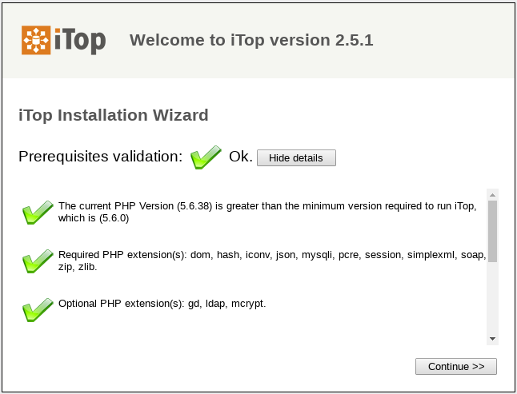

El segundo paso de la instalación ofrece la opción de actualizar un iTop existente o instalar la aplicación desde cero.

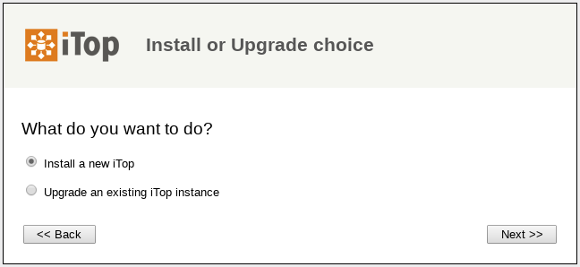

Si selecciona instalar una nueva instancia, el tercer paso del asistente le pedirá que acepte el acuerdo de licencia.

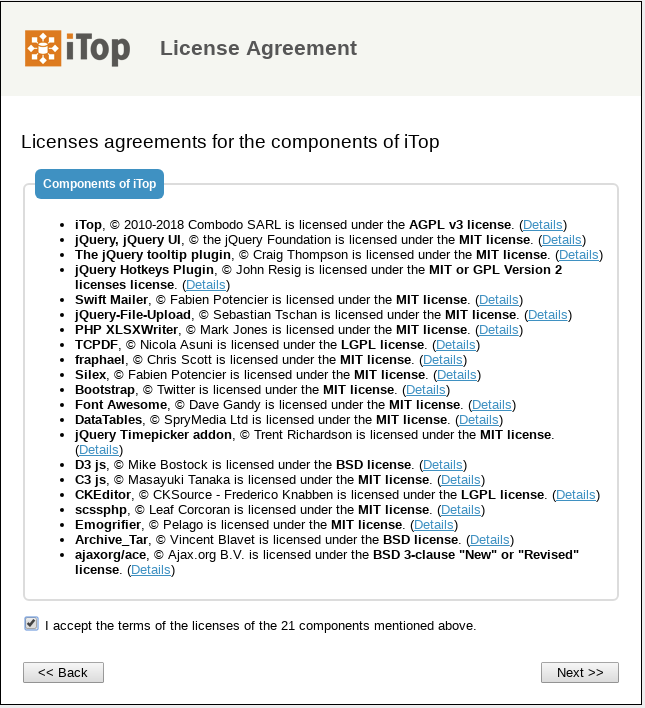

El cuarto paso del asistente le solicita las credenciales para conectarse a MySQL y la base de datos que debe usar para instalar iTop. Asegúrese de proporcionar una cuenta con suficientes derechos para instalar y ejecutar iTop. Esta cuenta necesita crear tablas, activadores y vistas en la base de datos, así como eliminar vistas en caso de actualización. Si elige que la configuración cree una nueva base de datos para usted, esta cuenta debe tener suficientes derechos para hacerlo.

También puede especificar un prefijo para agregar a los nombres de todas las tablas y vistas creadas por iTop en la base de datos. Útil si desea instalar varios iTop dentro de la misma base de datos MySQL, pero evite lo contrario. Es mejor crear múltiples bases de datos.

Tenga en cuenta que el servidor de la base de datos no necesita estar en el mismo servidor físico que el servidor web / PHP; puede ser un host remoto si prefiere tener una arquitectura de dos niveles o conectarse a un servidor MySQL ya instalado.

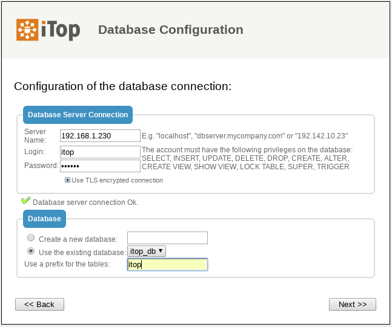

Nota:
	
	Si su base de datos se encuentra en un servidor compartido, puede especificar el puerto después del Nombre del servidor: my_server: 3309

El siguiente paso del asistente le solicita la información sobre la cuenta del administrador. La autenticación iTop puede basarse en mecanismos externos (LDAP, Active Directory o JASIG-CAS), pero la instalación requiere que se cree al menos una cuenta de administrador con una contraseña local.

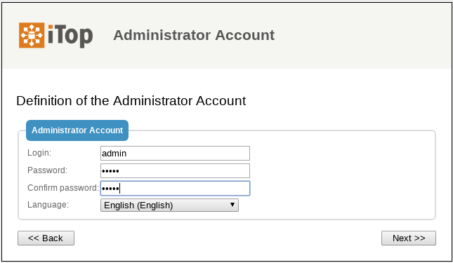

La siguiente pantalla le solicita información variada:

* idioma predeterminado: este es el idioma de la pantalla de inicio de sesión y el idioma predeterminado para las cuentas de usuario recién creadas.
* URL para acceder a iTop: cambie este valor si los usuarios accederán a iTop utilizando una URL diferente (gracias a un alias de DNS, una dirección IP diferente, etc.)
* datos de muestra: instale datos de muestra si desea experimentar rápidamente con iTop. Los datos de muestra proporcionan algunos elementos de configuración de muestra (servidores, aplicaciones, contactos) y configuraciones predeterminadas para el catálogo de servicios con el fin de garantizar una implementación rápida de la aplicación. No seleccione esta opción si está implementando una instancia de producción de iTop y desea una instalación "limpia".

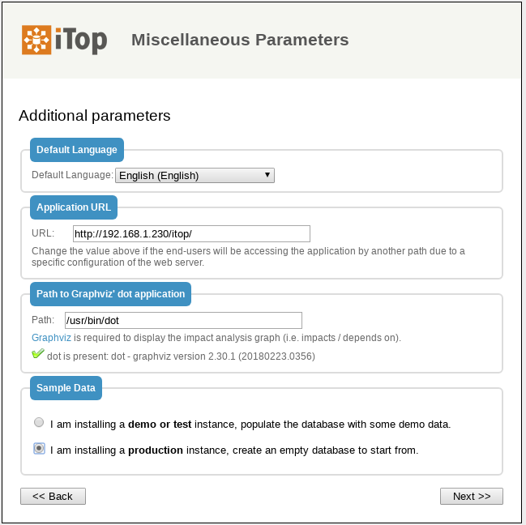

En caso de que haya varios hosts virtuales que apunten a iTop o si está utilizando un sistema de prueba con una dirección IP dinámica (DHCP) y desea conectarse de cualquier otro sistema, la "dirección" del servidor iTop no se puede arreglar en el momento de la instalación . En este caso, puede usar el marcador de posición $_SERVER_NAME_$ en el parámetro de URL. Por ejemplo, puede escribir: http://$_SERVER_NAME_ $/itop como la URL para acceder a la aplicación. En tiempo de ejecución, este valor será sustituido por el valor de la variable de PHP SERVER_NAME para la conexión actual.

Los siguientes pasos del asistente de instalación lo ayudarán a adaptar el "modelo de datos" de iTop para que se adapte mejor a sus necesidades.

Configurando el  CMDB
++++++++++++++++++++++

La CMDB está compuesta por 5 módulos:

* El módulo de Configuration Management Core que siempre está instalado. Este módulo proporciona los objetos básicos que siempre deben estar presentes en iTop: organizaciones, ubicaciones, contactos y algunos CI comunes como servidores, grupos, aplicaciones, etc.
* El módulo de gestión del centro de datos proporciona elementos de configuración para gestionar la logística de un centro de datos: bastidores, armarios, alimentación (PDU, fuentes de alimentación ...). Probablemente no necesite este módulo si no administra un centro de datos.
* Los módulos de Dispositivos de usuarios finales definen los dispositivos relacionados con los usuarios finales: teléfonos, PC, tabletas ... si no planea administrar dichos dispositivos en iTop, puede desactivar esta opción.
* El módulo Advanced Storage Management define los elementos de configuración relacionados con la administración de dispositivos de almacenamiento: switches SAN, NAS, bibliotecas y cintas de cintas, etc. Es opcional.
* El módulo de administración de virtualización define máquinas virtuales, hipervisores, granjas, etc. Puede desmarcarlo si no planea administrar dispositivos virtuales en iTop.

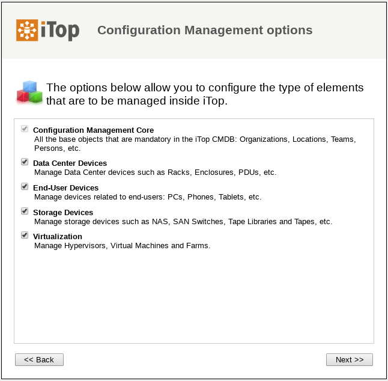

Configuración de gestión de servicios
++++++++++++++++++++++++++++++++++++++++++

La gestión del servicio viene en dos sabores en iTop. Elija la opción que mejor represente su situación:

* La gestión de servicios para empresas es más adecuada para describir una situación en la que se utiliza la misma infraestructura para prestar servicios a un conjunto de clientes. Los clientes pueden ser entidades internas de una organización común o clientes externos.
* La gestión de servicios para proveedores de servicios se adapta mejor si la infraestructura utilizada para entregar / respaldar a un cliente es específica para cada cliente con poca superposición (intercambio) entre los clientes.

**NOTA:** Si el modulo de  **Service Management for Service Providers** es seleccionado durante la instalación debe tener en cuenta  que el atributo  "services_list" en  VirtualMachines, debe ser ignorado para el Data Collector de OCS Inventory.

La documentación de estos dos módulos se agrupa en: Módulo de gestión de servicios (servicios, SLA, contratos).

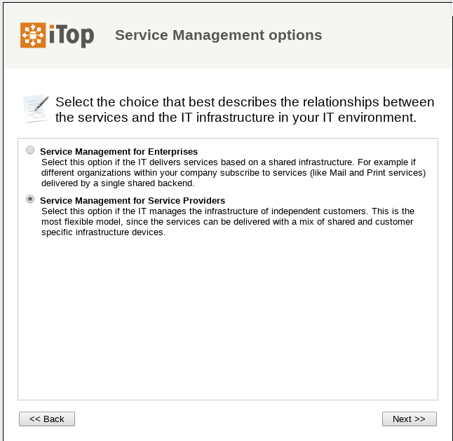

Configurando la gestión de tickets
++++++++++++++++++++++++++++++++++++

Si planea administrar tickets en iTop, básicamente hay dos opciones:

* Simple Ticketing es más adecuado para implementar procesos simples donde se hace poca diferencia entre los incidentes y las solicitudes de los usuarios. Todos los tickets comparten el mismo ciclo de vida y puede cambiar la caracterización de un ticket en cualquier momento. Esta opción es probablemente apropiada si planea permitir que los usuarios finales creen tickets directamente a través del portal para realizar solicitudes de servicio o para informar incidentes.
* Los boletos que cumplen con ITIL son los más adecuados para implementar procesos estrictos que cumplan con ITIL. Se hace una distinción clara entre las solicitudes de usuario y los tickets de incidentes. (Puede elegir implementar solo uno de estos procesos o ambos)

Por supuesto, también puede seleccionar no administrar dichos tickets en iTop en absoluto. En este caso, seleccione la tercera opción.

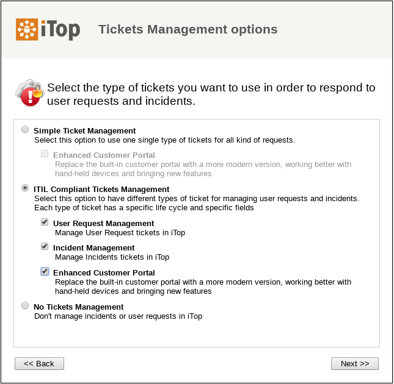

Configurando la gestión de cambios
+++++++++++++++++++++++++++++++++++

Si planea implementar Change Management en iTop, también hay dos opciones:

* Simple Change Management proporciona un solo tipo de tickets de solicitud de cambio para todos los propósitos.
* ITIL Compliant Change Management proporciona el conjunto completo de procesos de cambio compatibles con ITIL con tickets de Cambio Normal, Rutinario y de Emergencia.

También puede desactivar completamente la Gestión de cambios en iTop seleccionando la tercera opción.

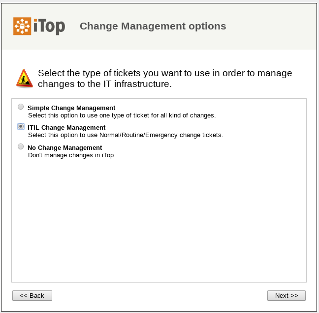

Procesos adicionales de ITIL
+++++++++++++++++++++++++++++++

Además de la administración de cambios e incidentes, se pueden implementar otros dos tipos de procesos compatibles con ITIL seleccionando el tipo de tickets correspondiente:

* Gestión de problemas
* Errores conocidos y preguntas frecuentes

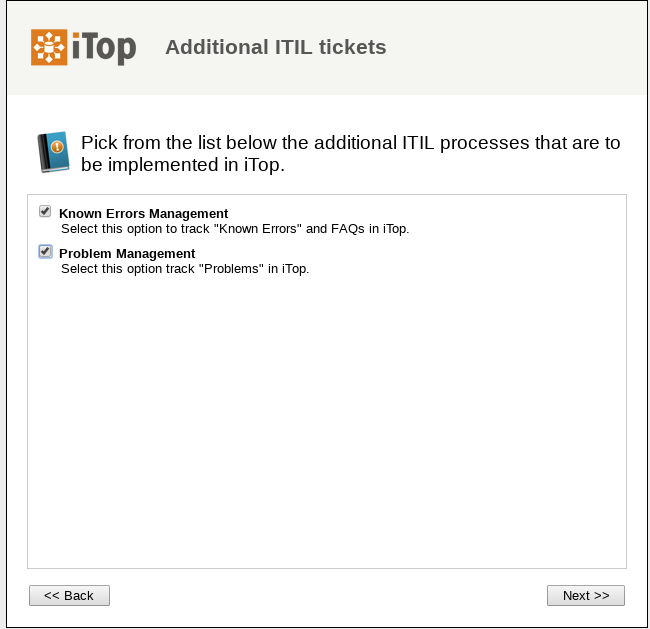

Procesos adicionales de las Extensiones
++++++++++++++++++++++++++++++++++++++++++

Se procede a implementar las extensiones que se hayan colocado de forma manual en el directorio "extensions"

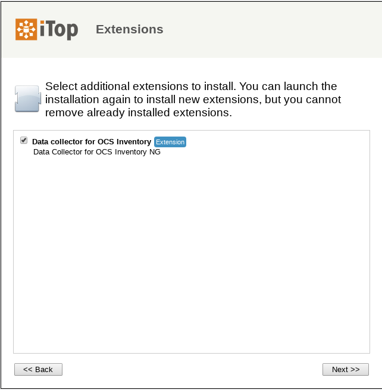

Lanzamiento de la instalación
++++++++++++++++++++++++++++++++

Una vez que se hacen todas las elecciones, se muestra un resumen. Puede profundizar para verificar sus opciones haciendo clic en el botón "más" para cada sección.

Para iniciar la instalación real de iTop, haga clic en el botón "Instalar!".

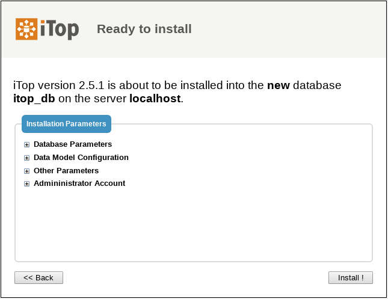

El progreso de la instalación se muestra con una barra de progreso en movimiento.

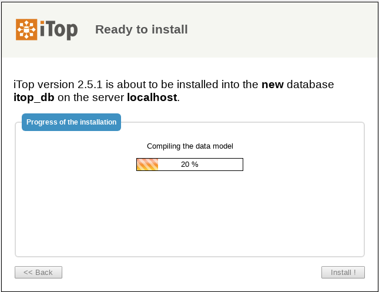

Una vez realizada la instalación, puede: Revisar las instrucciones sobre la configuración de las tareas en segundo plano, haciendo clic en el enlace "Instrucciones manuales para la administración de boletos". O ingrese a iTop inmediatamente haciendo clic en el botón "Entrar a iTop".

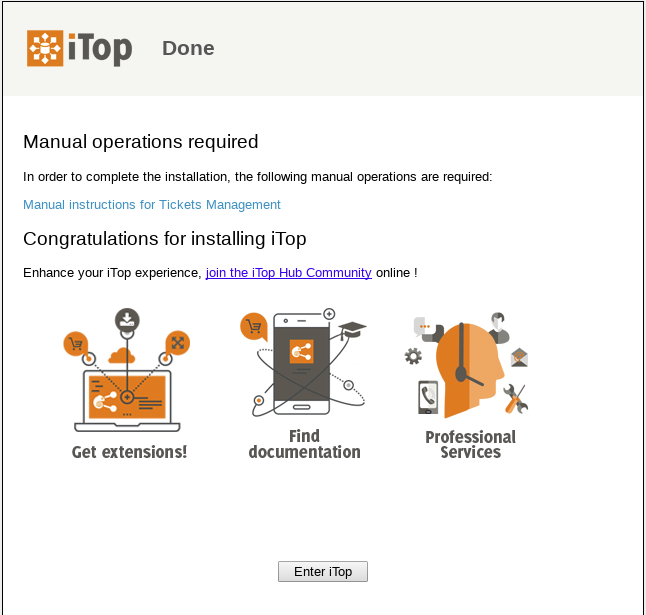

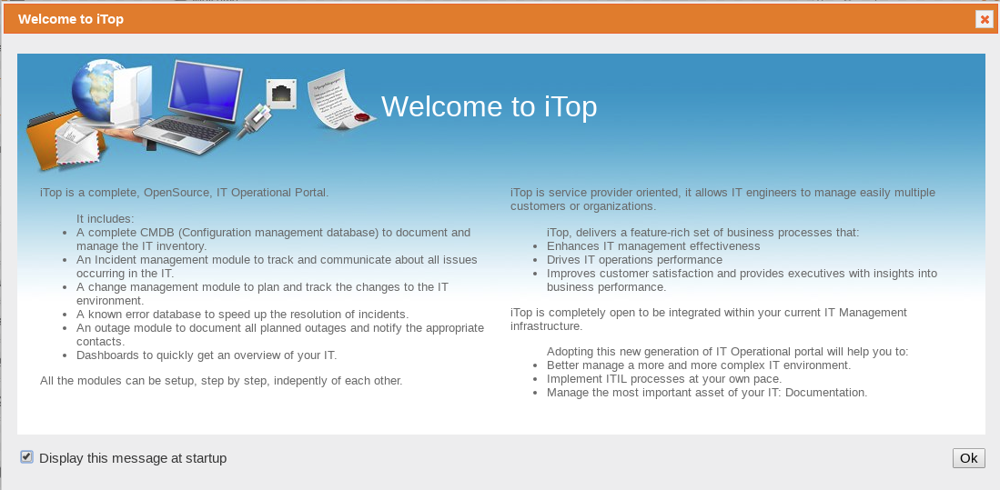

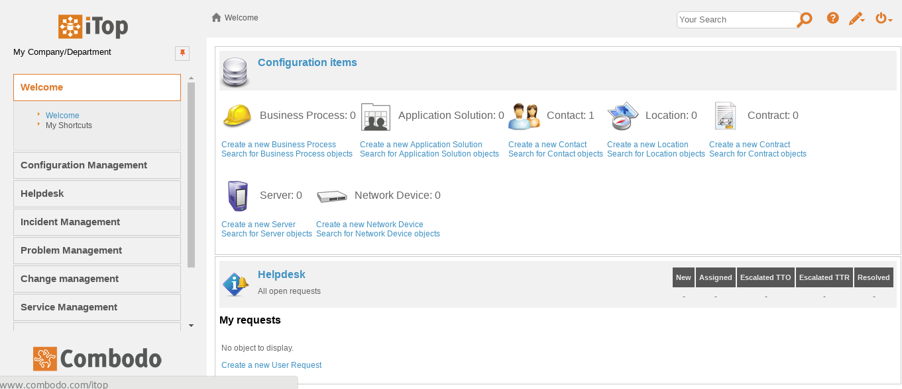

